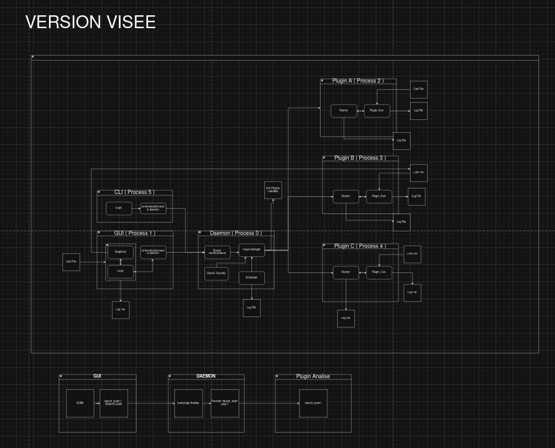
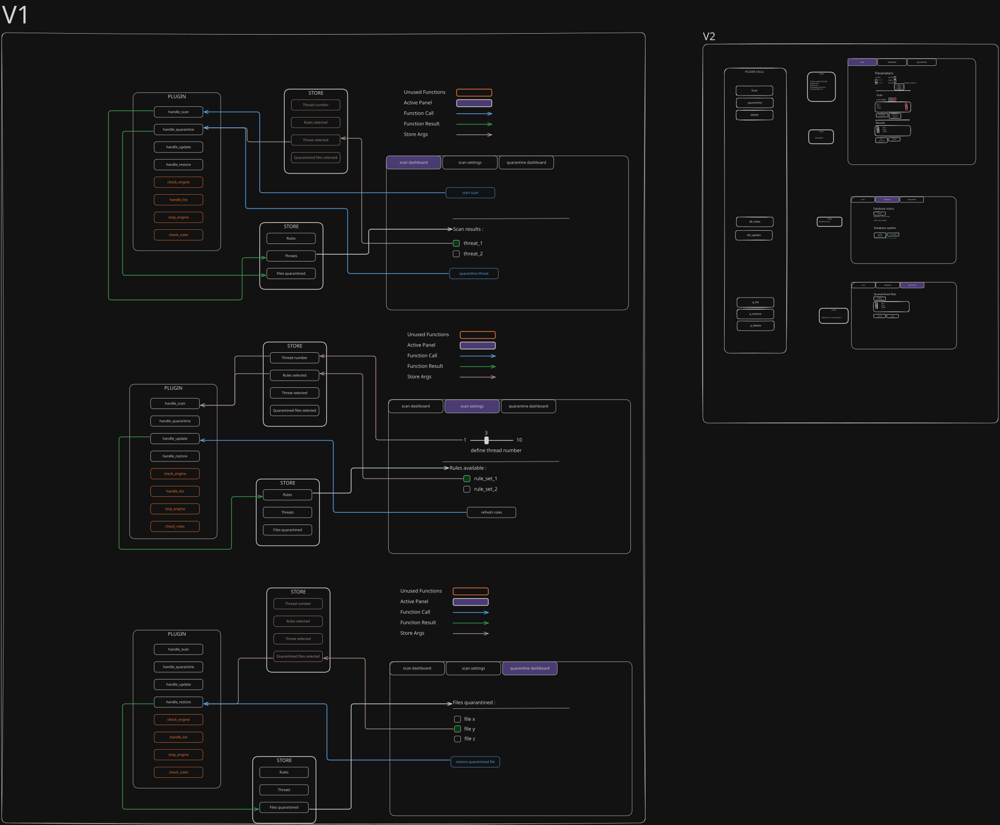

**Project:** Griffon — Modular Security Platform for Linux (Rust) **Repository:** https://github.com/GriffonAV/griffon **Live docs / website:** https://griffon-av.vercel.app/

> This document is a **proof of work**, not a duplicate of the project's documentation. Each section explains _what was done and why_, and links directly to the real artifact (README, docs site, specific file, or commit) instead of re-pasting it here. If you want to check the actual content, follow the links.

---

## 1. Clear, justified architecture

### 1.1 Overview

Griffon is split into independent components rather than one monolithic app, so the daemon, the scanning logic, the CLI and the GUI can evolve and fail independently:

- **Daemon** (`daemon/`) — the always-on Rust core: loads heavy data once (e.g. YARA rules), manages plugin lifecycle, exposes an IPC interface.
- **Plugin system** (`plugins/`) — security features (scanner, cleaner, docker helper, …) are compiled as dynamic plugins loaded through a stable ABI contract (`shared/plugin_interface/`), not hard-coded into the daemon.
- **CLI** (`cli/`) — a thin client that connects to the running daemon over IPC.
- **GUI** (`gui/`) — a Tauri v2 + Next.js/shadcn-ui desktop app, also talking to the daemon via local JSON messages.
- **Shared crates** (`shared/`) — `ipc_protocol`, `logger`, `plugin_interface`: common contracts used by every component so the daemon, CLI and plugins agree on the same message format.

Full breakdown of the folder/module structure: see the [README → "Folder / module structure"](https://github.com/GriffonAV/griffon#folder--module-structure).

### 1.2 Why this structure (justification)

|Choice|Reasoning|
|---|---|
|Rust workspace (daemon/cli/shared/plugins as separate crates)|Memory safety + one build graph, but each binary/plugin can be built, tested, and versioned independently.|
|Plugin architecture with a stable ABI (`abi_stable`) instead of hard-coded features|New security tools = new plugin (Rust logic + TOML manifest), not a fork of the core engine. Matches the project's stated goal: "write your security tool in a Rust plugin, define a TOML config, we auto-generate the UI."|
|Daemon/GUI/CLI separation over a single desktop binary|The daemon needs to run headless as a systemd service; GUI and CLI are just optional clients. This also keeps privileged scanning logic out of the (less trusted) UI process.|
|Tauri + Next.js for the GUI instead of Electron|Smaller binary size and lower memory footprint than Electron, while still allowing a modern web-based UI (see [Technologies choice](https://griffon-av.vercel.app/docs/category/technologies-choice) docs for the full comparison).|
|YARA-X for the scanner plugin|Industry-standard, actively maintained rule engine, avoids reinventing detection logic.|

Each built-in plugin also runs isolated from the daemon: **plugins are loaded in a separate process**, so a crash or fault in a plugin (e.g. the scanner) doesn't take down the daemon, the GUI, or the CLI. This is both an architecture choice and a reliability/security measure (see section 3).

### 1.3 Data flow / deployment

- **Packaged install:** `.deb`/`.rpm` → `postinstall.sh` registers a systemd service → daemon autostarts → GUI/CLI connect locally.
- **From source:** `just update-plugins` copies each plugin's `.toml` + `.so` into the dev config folder the daemon reads from, then `just run-daemon` / `run-gui` / `run-cli` each start a component in its own terminal.

---

## 2. Complete technical documentation

### 2.1 Structured README

The repository README already covers everything KPI 2 asks for a structured README to contain, so instead of duplicating it, here's where each required part lives:

|Required item|Location|
|---|---|
|Project purpose|[README → Project purpose](https://github.com/GriffonAV/griffon#project-purpose)|
|Install / deploy|[README → Installation](https://github.com/GriffonAV/griffon#installation) (`.deb` / `.rpm`) and [Running from source](https://github.com/GriffonAV/griffon#running-from-source-development)|
|Folder / module structure|[README → Folder / module structure](https://github.com/GriffonAV/griffon#folder--module-structure)|
|Key commands|[README → Key commands](https://github.com/GriffonAV/griffon#key-commands) (`just run-daemon`, `just run-gui`, `just run-cli`, `just update-plugins`, `cargo build/test`)|
|Environment variables|[README → Environment variables](https://github.com/GriffonAV/griffon#environment-variables) — Griffon uses config files instead of env vars, and the README explains where those files live depending on how you run it|
|Technical prerequisites|[README → Technical prerequisites](https://github.com/GriffonAV/griffon#technical-prerequisites)|

### 2.2 Advanced documentation (beyond the README)

Griffon goes beyond a single README with a full documentation site ([griffon-av.vercel.app](https://griffon-av.vercel.app/), built with Docusaurus):

- [Developer documentation / Introduction](https://griffon-av.vercel.app/docs/introduction) — explains the 3-layer architecture (daemon / plugin system / auto-GUI).
- [Installation & Releases](https://griffon-av.vercel.app/docs/installation)
- [Plugin Development](https://griffon-av.vercel.app/docs/category/plugin-development) — guide for writing a new plugin (also mirrored in `plugins/plugin-guide.md` in the repo).
- [Technologies choice](https://griffon-av.vercel.app/docs/category/technologies-choice) — documented rationale for the stack (Rust, Tauri, YARA-X, etc.), which directly supports the "justified architecture" requirement above.
- [Team documents](https://griffon-av.vercel.app/docs/category/team-documents) and a [public Notion board](https://blue-touch-18c.notion.site/Griffon-AV-1c6f05587c8380eb9fbeea36f549fd47?pvs=74) with threat modeling, architecture decisions and development logs.
- A dedicated beta test plan at the repo root: [`G-EIP-700_beta_test_plan.md`](https://github.com/GriffonAV/griffon/blob/main/G-EIP-700_beta_test_plan.md).

This satisfies the "at least one advanced document (architecture diagram / technical use case / roadmap)" requirement — the Docs site + Notion board together cover architecture rationale, plugin development guide, and a test plan.

Two architecture diagrams exist on the team's public Notion board, covering exactly what KPI 2 asks for ("at least one advanced document: architecture diagram / technical use case / roadmap"):

- **Daemon ↔ plugin communication diagram** — shows how the daemon loads/talks to plugins over IPC and how each plugin runs in its own isolated process.
- **GUI implementation diagram** — shows how the Tauri/Next.js frontend communicates with the daemon via local JSON messages.

Both are on the [public Notion board](https://blue-touch-18c.notion.site/Griffon-AV-1c6f05587c8380eb9fbeea36f549fd47?pvs=74).

---

## 3. Quality, reliability & security

| Requirement                                   | Status | Evidence / link                                                                                                                                                                                                                                                                                                                                                                                                 |
| --------------------------------------------- | ------ | --------------------------------------------------------------------------------------------------------------------------------------------------------------------------------------------------------------------------------------------------------------------------------------------------------------------------------------------------------------------------------------------------------------- |
| Code standards (linting, conventions, typing) | ✅      | Enforced via a **pre-commit git hook** (`.githooks/`) that runs `cargo fmt --check` and `cargo clippy`. A commit that fails formatting or lint is blocked locally before it can even reach the remote.                                                                                                                                                                                                          |
| Quality analysis tools                        | ✅      | `cargo clippy` (linting) + `cargo fmt` (formatting), both run pre-commit _and_ in CI (see below), so quality gates aren't optional/skippable.                                                                                                                                                                                                                                                                   |
| CI enforcement                                | ✅      | A **GitHub Action** re-runs the same fmt/clippy checks server-side and **blocks push/merge into `dev`** if they fail — so the hook can't be bypassed by skipping it locally. See [`.github/`](https://github.com/GriffonAV/griffon/tree/main/.github) for the workflow(s).                                      |
| Supply-chain / dependency checks              | ✅      | [`deny.toml`](https://github.com/GriffonAV/griffon/blob/main/deny.toml) at repo root — `cargo-deny` audits dependencies and licenses.                                                                                                                                                                                                                                                                           |
| Unit tests — scanner plugin                   | ✅      | Checks path inclusion/exclusion logic and every scan option/argument combination. Not a huge count of tests, but each one targets a critical behavior (a wrong path filter or a broken flag would silently mis-scan the system).                                                                                                                                                                                |
| Performance/benchmarks — scanner              | ✅      | Dedicated **benchmarks for threading and scan performance** (see `bench/` at repo root).                                                                                                                                                                                                                                                                                                                        |
| Tests — cleaner plugin                        | ✅      | More complex validation: a **Grafana dashboard** tracks clean-run results, plus a broader performance benchmark run against different sets of test files (varying file counts/sizes/types).                                                                                                                                                                                                                     |
| Cross-distro testing                          | ✅      | Each plugin can be tested inside **Vagrant VMs**, used to validate behavior across different Linux distributions.                                                                                                                                                                                                                                                                                               |
| Error handling, logging                       | ✅      | Shared `logger` crate (`shared/logger/`) used across daemon/plugins.                                                                                                                                                                                                                                                                                                                                            |
| Security measures                             | ✅      | **EICAR test files** are used to validate the scanner's detection path instead of handling real malware samples. Anything that risks damaging the host (e.g. destructive cleaner actions) is tested inside a **Vagrant VM**, never on the dev machine. The app is standalone (no cloud dependency), and **each plugin runs in its own isolated process**, so a plugin crash can't take down the daemon/GUI/CLI. |
| Reference                                     | —      | Repo also has a [`SECURITY.md`](https://github.com/GriffonAV/griffon/blob/main/SECURITY.md) with the disclosure policy.                                                                                                    

---

## 4. Expected deliverables — checklist

- [x] Complete README → [github.com/GriffonAV/griffon](https://github.com/GriffonAV/griffon#readme)
- [x] Architecture/deployment diagrams (daemon↔plugin comms, GUI implementation)
- [x] Changelog / technical plan → Notion board + `G-EIP-700_beta_test_plan.md`
- [x] Example config files (plugins/plugin template)
- [x] Code-quality reports → pre-commit hook + GitHub Action enforcing `cargo fmt`/`cargo clippy`
- [x] Screens/results of unit/validation/perf tests → scanner unit tests + threading/perf benchmarks (`bench/`), cleaner Grafana dashboard, Vagrant cross-distro runs
- [x] Technical wiki / annex documentation → [griffon-av.vercel.app/docs](https://griffon-av.vercel.app/docs/introduction) + Notion board
- [x] Install/deploy scripts → `scripts/postinstall.sh`, `scripts/preremove.sh`, `Dockerfile.build`, packaging via `nfpm.yaml`