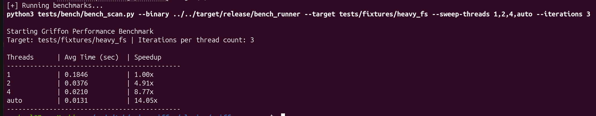
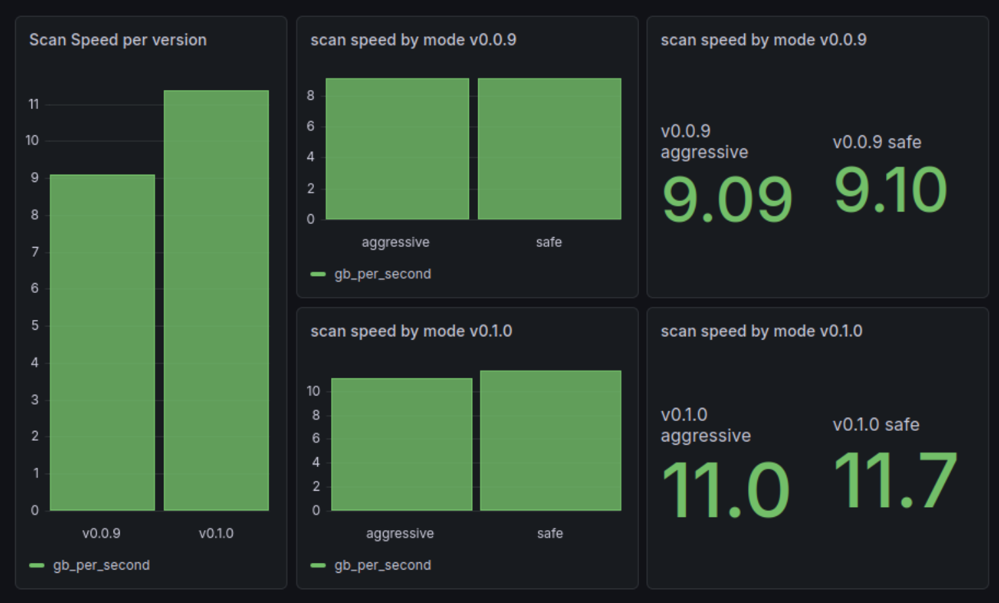
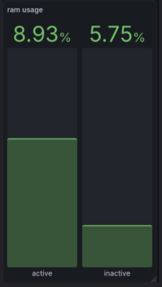

**Project:** Griffon — Modular Security Platform for Linux (Rust)  
**Repository:** https://github.com/GriffonAV/griffon  
**Live docs / website:** https://griffon-av.vercel.app/  

> This document is a **proof of work**, not a duplicate of the project's documentation. Each section explains _what was done and why_, and links directly to the real artifact (README, docs site, specific file, or commit) instead of re-pasting it here. If you want to check the actual content, follow the links or check the related subfolder kpi-d.
---

## 1. Define key technical metrics
### 1.1 Overview

Griffon is a complex application composed of multiple modules. For this reason, we have divided the performance indicators into several categories: module-specific indicators and global indicators.

We have also classified these indicators into subcategories to distinguish whether they are related to the end-user experience or are purely technical.

For example, in the Purely Technical category of the Cleaner module-specific indicators, we have:

errors_by_type – the number of errors of each type encountered by the Cleaner during a scan.

This metric does not directly affect the user experience, but it helps analyze different testing scenarios by determining whether certain types of errors have an impact on other performance indicators.

A general definition of all performance indicators can be found in [2026-04-01_TECH_004_metrics.md](kpi-d/2026‐04‐01_TECH_004_metrics.md) or on the project documentation [here](https://griffon-av.vercel.app/blog/metrics_definition).  
More detailed information about the Cleaner module's performance indicators is available in [Cleaner.md](kpi-d/Cleaner.md) or [here](https://griffon-av.vercel.app/docs/modules/Cleaner).

---

### 1.2 Integrating them in the developpement cycle

These metrics are used whenever we make a new release of the project or of a module. You can find a broad documentation on our ideal realease pipeline in [release_pipeline_guide.md](kpi-d/release_pipeline_guide.md).

Before making a new release we run tests on the new version, the data of these tests is then fed into the corresponding _grafana_ dashboard and a performance report is made to see if the new version attained it's objectives.

note: grafana is a third party software used for performance monitoring see [grafana.md](kpi-d/grafana.md) or [here](https://griffon-av.vercel.app/docs/technologies/grafana) for more details on our usage of the tool.

## 2. Set up automated/manual tests

### 2.1 load and stress tests

To collect data for the related metrics of each part of the project we wrote testing procedures to test each part, those testing procedures includes load and stress test.

These test are neccesary to colect metrics related to differents usage of, for example the cleaner module we need to test an **aggresive scan** mode that correspond to a stress test.

You can find the documentation we wrote on how to run these tests in [cleaner_benchmark_readme.md](kpi-d/cleaner_benchmark_readme.md)

### 2.2 comparative efficiency tests

Comparative efficiency tests are the type of test we have the most in the project because they are the key to spot any regression or to measure if an update had the expected performance boost.

We also use them to test diffent settings of our modules.

Here are three examples of such tests :

---
  
This test is to compare the time gain when using different numbers of thread while running the scanner module. It is usefull to spot the sweetspot of the default numbers of thread we should use.  

---
  
This dashboard show the results of the average of multiples tests run in both safe and aggresive mode for the version 0.0.9 and 0.1.0 of the cleaner module. Combined with other metrics suchs as error numbers, it can helps us indentify bottlenecks in the module execution.

---  
  
This screenshot of a part of the daemon dashboard shows the difference in ram usage when the daemon is on with no plugin loaded (inactive) and when it has a plugin loaded (active)

### 2.3 tools we use

We use grafan to visualize the data we crunch from our tests.

We also use pythons scripts we made to automate testing, here is an example for the scanner thread count testing [scanner_bench_scan.py](kpi-d/scanner_bench_scan.py).  
It can conveniently be run with a simple command thanks to our just-files [scanner_justfile](kpi-d/scanner_justfile)

To make test reproducible we use vagrant to generate virtual machines, and then use python script along with json files to setup different scenarios.

See [cleaner_bench_readme.md](kpi-d/cleaner_bench_readme.md) for details on the environement we use, along with the [Vagrantfile](kpi-d/Cleaner_Vagrantfile) for the specific config, additionaly you will find the different scenarios in the form of json files in the `kpi-d/cleaner_test_configs/` folder.

## 3. Implement optimizations

### 3.1 test results interpretation

All the tests we do would stay as mere statistics if we didn't interpret the results we got, as shown in a previous scennshot we use grafana dashboards to keep tracks of tests results.

We have a readme [grafana_readme.md](kpi-d/grafana_readme.md) on how to use the grafana dashboard and how to insert data into it, as well as scripts [cleaner_data_pipeline.py](kpi-d/cleaner_data_pipeline.py) to automate the process.

The documents in which we actually interpret those results are in the performance reports, they all follow the same template we made, you can find it in [performance_report_template.md](kpi-d/performance_report_template.md) or [on our online documentation](https://griffon-av.vercel.app/docs/organisation/performance_report_template)

An example of such reports can be found in [Cleaner_performance_report.md](kpi-d/Cleaner_performance_report.md)

### 3.2 bottlenecks and future plans

Those performances report and other forms of results interpretation allow us to identify bottlenecks in our projects and to make plans around those bottlenecks for the future of the project.

A lot of these reports are discused during regular meetings (you can find written summaries of all our meeting [on our public notion](https://blue-touch-18c.notion.site/29af05587c838072adebfd54cc851b63?v=29af05587c838056b16c000c6d714923)) and they lead to the creation of documents reflecting on the future plans for the projects.

The documents in question can be found in [our online technical documentation](https://blue-touch-18c.notion.site/2bef05587c8380208422e55e25ce10fa?v=2bef05587c83809f8048000cba879634) and one good example of that is [this document](https://blue-touch-18c.notion.site/2bef05587c8380208422e55e25ce10fa?v=2bef05587c83809f8048000cba879634&p=398f05587c8380c4b942cc0310bc6667&pm=s) reflecting on what features are curently missing in our scanner module, for example _Hash Caching_ that is needed to overcome a performance bottleneck.

